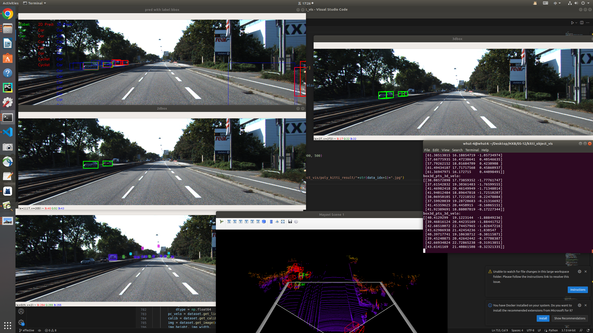

# kitti_native_evaluation

此项目供私人使用 

此仓库在4号服务器保存路径：/home/whut-4/Desktop/HXB/05-04/kitti_native_evaluation-master

原版代码：https://github.com/asharakeh/kitti_native_evaluation

注意：

- 用f-pointpilars检测时用如下指令

  ```
  python pytorch/train.py evaluate --config_path=configs/pointpillars/car/xyres_16.proto --model_dir=/home/whut-4/Desktop/HXB/F_Pointpillar/04-27/ZC/Frustum-Pointpillars/hxb_trainedmodel --pickle_result=False
  ```


- 效果图：

  


Disclaimer:

- These days, I found this code to be too slow for the turnover rate in deep learning development. I personally switched to using numba as done in https://github.com/traveller59/second.pytorch to compute AP in much faster times (~10 seconds per full run on validation set). I recommend you take a look if you need faster code with python integration.

Updates:
- 17/12/2017: Initial release.
- 18/02/2020: This code complies with the 40 recall point change on the official KITTI website.
- 18/02/2020: I am not actively developing this repository anymore. This will be the last update for the time being.

This code is based on Bo Li's repository: https://github.com/prclibo/kitti_eval with the main differences being some code cleanup and
 additional AHS metric described in our paper: [Joint 3D Proposal Generation and Object Detection from View Aggregation
                                               ](https://arxiv.org/abs/1712.02294)

`evaluate_object_3d_offline.cpp` evaluates your KITTI detection locally on 
your own computer using your validation data selected from KITTI training dataset, with the following metrics:

- overlap on image (AP)
- oriented overlap on image (AOS)
- overlap on ground-plane (AP)
- oriented overlap on ground-plane (AHS)
- overlap in 3D (AP)
- oriented overlap in 3D (3D AHS)

#### Compilation:
Clone the repo using: 
`git clone https://github.com/asharakeh/kitti_native_evaluation.git`

From inside the main folder do:
1. `cmake ./`
2. `make`

#### Usage:
Run the evalutaion by:

    ./evaluate_object_3d_offline groundtruth_dir result_dir

Note that you don't have to detect over all KITTI training data. The evaluator only evaluates samples whose result files exist.

## Data Format:
The detection format should be simillar to the KITTI dataset label format with 15 columns representing:

| Values        | Name           | Description  |
| ------------- |:-------------:|:-----|
| 1 |type| Describes the type of object: 'Car', 'Van', 'Truck', 'Pedestrian', 'Person_sitting', 'Cyclist', 'Tram', 'Misc' or 'DontCare'|
| 1 |truncated| -1|
| 1 |occluded| -1|
| 1 |alpha| Observation angle of object, ranging [-pi..pi]|
| 4 | bbox | 2D bounding box of object in the image (0-based index): contains left, top, right, bottom pixel coordinates|
| 3 | dimensions | 3D object dimensions: height, width, length (in meters)|
| 3 | location | 3D object location x,y,z in camera coordinates (in meters)|
| 1 | rotation_y | Rotation ry around Y-axis in camera coordinates [-pi..pi]|
| 1 | score | Only for results: Float, indicating confidence in detection, needed for p/r curves, higher is better.|

Example:

| type |truncated| occluded| alpha| bbox | dimensions | location | rotation_y| score|
| ---- |:----:|:----:|:----:|:----:| :----:| :----:|:----:|----:|
|Pedestrian| -1 |-1 |0.29| 873.70 152.10 933.44 256.07| 1.87 0.50 0.90| 5.42 1.50 13.43| 0.67| 0.99|

## Citation:
If you are using this code, please cite our paper:

[Joint 3D Proposal Generation and Object Detection from View Aggregation
](https://arxiv.org/abs/1712.02294)


`@article{ku2017joint,
  title={Joint 3D Proposal Generation and Object Detection from View Aggregation},
  author={Ku, Jason and Mozifian, Melissa and Lee, Jungwook and Harakeh, Ali and Waslander, Steven},
  journal={arXiv preprint arXiv:1712.02294},
  year={2017}
}`
